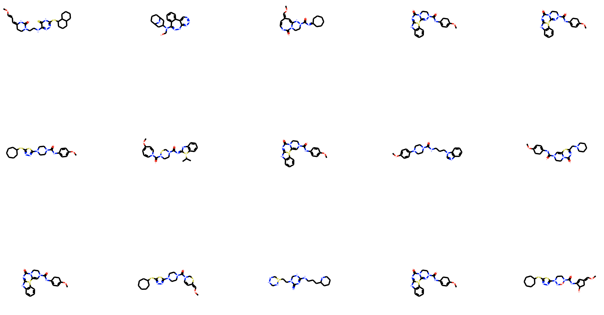

# Marco Nobile Master Thesis, Master of Science in Artificial Intelligence.
## Title: "Molecule Generation with Graph-Based Generative Adversarial Networks"

Developed in conjunction with professor Cesare Alippi and Daniele Grattarola as co-advisor.

Abstract:

De novo drug design is a challenging task. There is a long and expensive process from drug discovery to market, therefore, pharmaceutical and biotechnology industries are trying to  implement new digital technologies in the context of drug discovery and development. Deep learning has revolutionised the computer vision the and natural language processing fields, but its application to molecule generation has been limited due to its applicability to specific domains, given the requirement of regularity of input data structures.
Thanks to the innovative tool of Geometric Deep Learning, there has been a growth of interest in generative models for drug development, such as GraphVAE by Simonovsky and Komodakis [2018] and MolGAN by DeCao and Kipf [2018]. These models present different limitations, such as the incapability of generating molecules of varying dimension, and share a one-shot generation of the adjacency matrix, yielding to a low variety (≈ 2% in MolGAN) in the set of generated molecules, despite the considerable computational costs (O(n4) in GraphVAE). 
In this work we present a new algorithmic approach to the molecule generation task, divided in two steps: initially we generate a set of molecules using an autoregressive model; theneach generated molecule is modified using a graph-based GAN structure, such to achieve realistic molecules and outperform any supervised training criterion. 
The model here proposed, trained on the QM9 data set, achieved an average variety of ≈ 62% in the set of the generated molecules, and produced samples with interesting chemical 
properties when trained on a specific subset of the QM9 data set, improving the current state of the art in drug generation task.

Ref: 
- GraphVAE by Simonovsky and Komodakis [2018], URL: https://arxiv.org/abs/1802.03480
- MolGAN by DeCao and Kipf [2018], URL: https://arxiv.org/abs/1805.11973

Examples of molecules generated:

    

